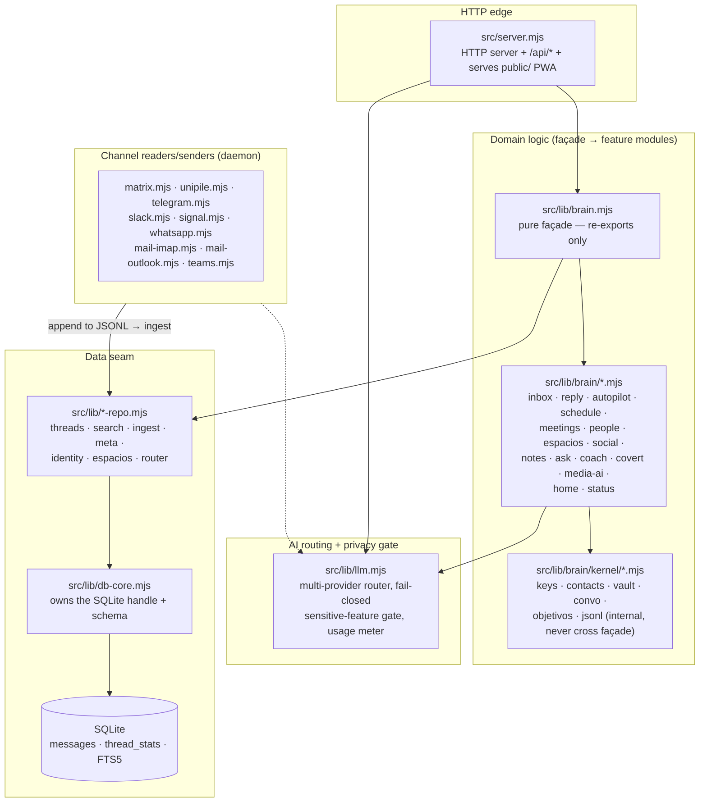

# Architecture — module map

This document maps the source tree: which module owns what, and how the layers fit
together. For the runtime component / data-flow view (channels → daemon → SQLite →
API → PWA) see [`docs/ARCHITECTURE.md`](docs/ARCHITECTURE.md).

The stack is deliberately boring: vanilla Node 20 (ESM, the built-in `http` server,
no framework, no build step), `better-sqlite3`, and a hash-routed vanilla-JS PWA.
Thin façades sit in front of per-domain modules so the surface stays small.

## Layers at a glance

## 1. HTTP edge — `src/server.mjs`

The single HTTP entry point. Uses Node's built-in `http.createServer`, serves the
`public/` PWA as static files, and exposes the JSON `/api/*` surface the web app and
the mobile app both consume. It wires together the domain façades (`brain`, `hub`,
`meetings`, `accounts`, `integrations`, …) and the LLM router. Auth (PIN + cookie
session) is applied here. It is intentionally *not* split — treat it as the wiring
harness, not domain logic.

## 2. Domain logic — `src/lib/brain.mjs` façade → `src/lib/brain/*`

`brain.mjs` is a **pure façade with zero logic of its own**: it only re-exports the
per-domain feature modules. Adding public API = one more `export *`.

| Feature module (`src/lib/brain/…`) | Owns |
|---|---|
| `inbox.mjs` | Unified inbox: thread summaries, catch-up |
| `reply.mjs` | Drafting / sending replies (incl. Slack `chat.postMessage`) |
| `autopilot.mjs` | AI reply autopilot: learned voice, feedback bank, policy guard |
| `schedule.mjs` | Reminders / scheduling |
| `meetings.mjs` | Meeting prep + summaries |
| `people.mjs` | Contacts, ego-graph, enrichment surface |
| `espacios.mjs` | "Spaces": rule-based grouping of contacts |
| `social.mjs` | Social reader surface |
| `notes.mjs` | Notes + notes-AI |
| `ask.mjs` | Ask-the-brain (RAG + FTS) |
| `coach.mjs` | Proactive brief / focus / nudges |
| `covert.mjs` | Covert mode (steganographic messaging) |
| `media-ai.mjs` | Media understanding (OCR, audio, images) |
| `home.mjs` | Dynamic home / brief |
| `status.mjs` | System / connection status |

Internal **kernels** in `src/lib/brain/kernel/` (`keys`, `contacts`, `vault`,
`convo`, `objetivos`, `jsonl`) are shared machinery that must **not** cross the
façade — feature modules use them, external callers never import them directly.

## 3. AI routing + privacy gate — `src/lib/llm.mjs`

The multi-provider LLM router with automatic fallback (Gemini → OpenAI → Ollama,
order configurable via `LLM_CHAIN`), bring-your-own-key per hub, a usage meter with a
hard cap, and the **fail-closed privacy gate** for `SENSITIVE_FEATURES` (see
[PRIVACY.md](PRIVACY.md)). This is the single authorized cloud-egress layer for AI,
enforced by `test/no-cloud-fetch.mjs`.

## 4. Data seam — `src/lib/*-repo.mjs` → `src/lib/db-core.mjs`

`db-core.mjs` **owns the SQLite handle and the schema**. The rule of the seam: the
handle never crosses it — it stays private in `db-core`, repos obtain it internally
via `handle()`, and callers use named queries.

| Repo | Responsibility |
|---|---|
| `threads-repo.mjs` | Conversation reads: inbox summaries, messages per thread, paging, unread, media |
| `search-repo.mjs` | Full-text (subject via `messages_fts`, email body via `email_fts`) + RAG surface |
| `ingest-repo.mjs` | Write path: insert messages, upsert `thread_stats`, rebuilds |
| `meta-repo.mjs` | Key-value (`meta`) + action lists (clips, todos, promises) |
| `identity-repo.mjs` | Re-keying / merge / dedup / thread unification (transactional) |
| `espacios-repo.mjs` | Match messages against space rules (email/domain/phone/name) |
| `router-repo.mjs` | Facet router (cheap pre-computed search) + weighted graph |

## 5. Channel readers/senders

Each source has its own reader (run by the daemon, `src/daemon.mjs`, with
auto-restart). Readers append events to a JSONL log which `ingest` folds into SQLite
(dedup by id); senders push your replies back out.

| Module | Channel(s) |
|---|---|
| `src/matrix.mjs` | WhatsApp (mautrix bridge) and Matrix rooms |
| `src/unipile.mjs` | WhatsApp / Instagram / Messenger / Discord via Unipile |
| `src/telegram.mjs` | Telegram |
| `src/slack.mjs` | Slack |
| `src/signal.mjs` | Signal |
| `src/whatsapp.mjs` | WhatsApp (Baileys direct) |
| `src/mail-imap.mjs` | Email over IMAP |
| `src/mail-outlook.mjs` | Outlook / Microsoft Graph mail |
| `src/teams.mjs` | Microsoft Teams |

## 6. Tests

`npm test` runs the portable suite (`node --test`, ~251 tests): pure logic, data-seam
characterization, the auth/secret/covert surfaces, and the privacy invariants
(`test/no-cloud-fetch.mjs`, `test/llm-*`, `test/http-gate.mjs`). Integration tests
(`test/integration.mjs`) need a live server + real DB and are not run in CI.
