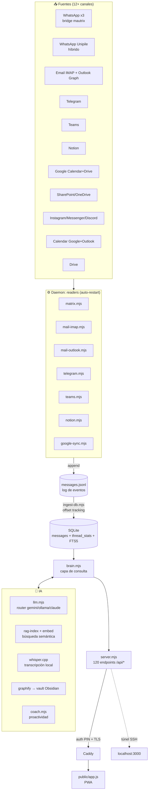
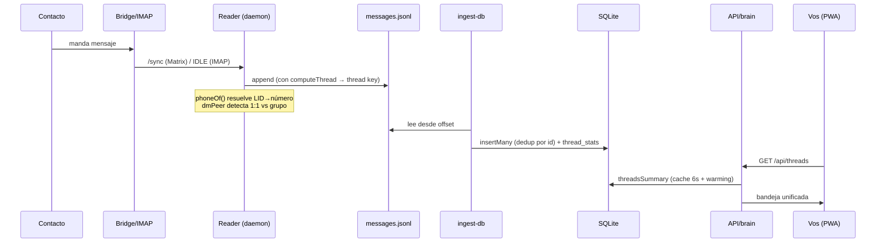
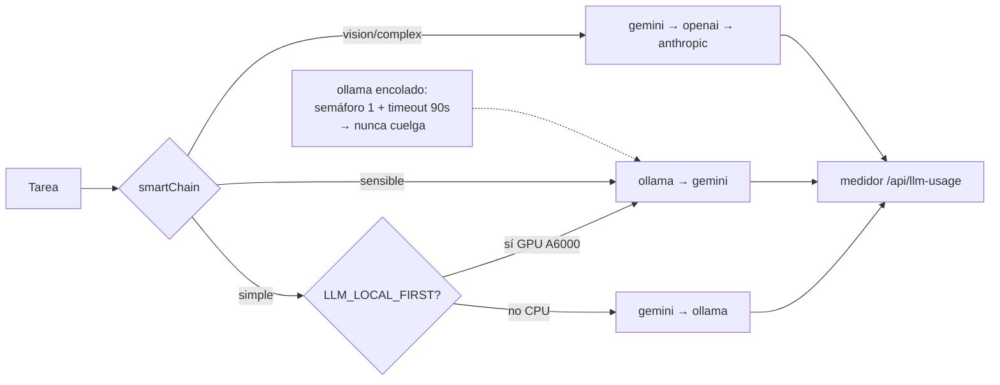

# pipe.one — Arquitectura

Segundo cerebro / inbox unificado + AI-OS. Node 20 (vanilla `http`, sin framework) + SQLite (1.96M mensajes) + PWA vanilla-JS. Corre en un servidor headless (VPS), expuesto por Caddy (TLS + PIN) en `hub.example.com`.

## 1. Vista general (componentes)

## 2. Flujo de un mensaje (ingesta → visible)

## 3. Router de LLM (la "tercera vía")

## 4. Conceptos clave

| Concepto | Qué es | Dónde |
|---|---|---|
| **Thread key** | Clave determinística de conversación. WhatsApp 1:1 → por número; grupos → `@g.us`/`!room`; email → `email:<addr>`; self → `self`. | `lib/thread.mjs computeThread` |
| **thread_stats** | Índice denormalizado de hilos (last_ts, count, channels) → bandeja rápida. Auto-sanado si se vacía. | `lib/db.mjs`, `lib/maintenance.mjs` |
| **Espacios** | Agrupar contactos por reglas (email/dominio/teléfono/nombre), anidados, con catch-all. Match dinámico → retroactivo. | `lib/workspace.mjs`, `lib/brain.espacioView` |
| **Coach** | Cada 4h analiza señales (pendientes, promesas, preguntas, notas, importancia) → brief + foco + nudges. | `coach.mjs`, `lib/signals.mjs` |
| **Notetaker** | Graba calls en el cliente (Mac/Android), sube a `/api/meeting/ingest`, transcribe híbrido (whisper local si sensible / Gemini si no). | `lib/meetings.mjs`, `lib/whisper.mjs`, `agents/` |
| **Auth** | Local (túnel SSH sin XFF) = confiable; remoto (vía Caddy con XFF) = PIN scrypt + cookie token. | `lib/auth.mjs` |
| **Catch-up / ask** | Resumen multimodal de lo perdido + chat global RAG (semántico + FTS sobre 2M msgs). | `lib/brain.catchup / ask` |

## 5. Reglas de oro (aprendidas a los golpes)
- **Fire-and-forget** para crons; nunca loops paralelos pesados dentro del server.
- **Verificar el schema** (`src/lib/db.mjs`) antes de escribir SQL.
- **NO merges/correctores pesados con el server vivo** (SQLITE_BUSY) → función in-proceso o stop/start.
- **ollama en CPU cuelga** → todo lo interactivo va gemini-first; ollama encolado + timeout.
- **`j()` lee solo la cola** de archivos >200MB (messages.jsonl >1GB rompía con ERR_STRING_TOO_LONG).
- **Detrás de proxy** `remoteAddress` siempre es 127.0.0.1 → distinguir local/remoto por `X-Forwarded-For`.

## 6. Tests
- **Integración** (`test/integration.mjs`, 21+): contra el server vivo + DB. `node test/integration.mjs [--llm]`.
- **Unitarios** (`test/unit.mjs`): funciones puras (thread keys, router). `node --test test/unit.mjs`.
- **Referencia auto-generada**: `node scripts/gen-docs.mjs` → `docs/REFERENCE.md`.
- Todo junto: `node scripts/test-all.mjs`.
